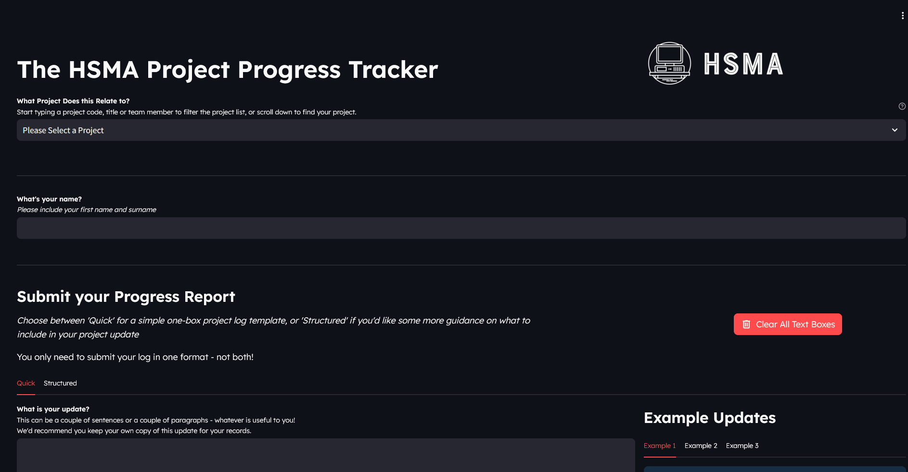
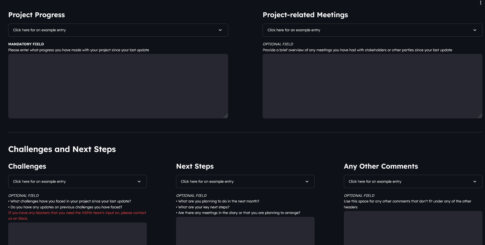

# The HSMA Project Progress Tracker

An app for submitting project progress reports to

- allow the HSMA team to keep track of project progress and identify common challenges across the cohort
- allow the individual teams to generate a record of their work, which could be used as part of a portfolio of evidence

Reports are sent to a Supabase database.

Users can choose to submit a simplified project report:

Or a more complex one

